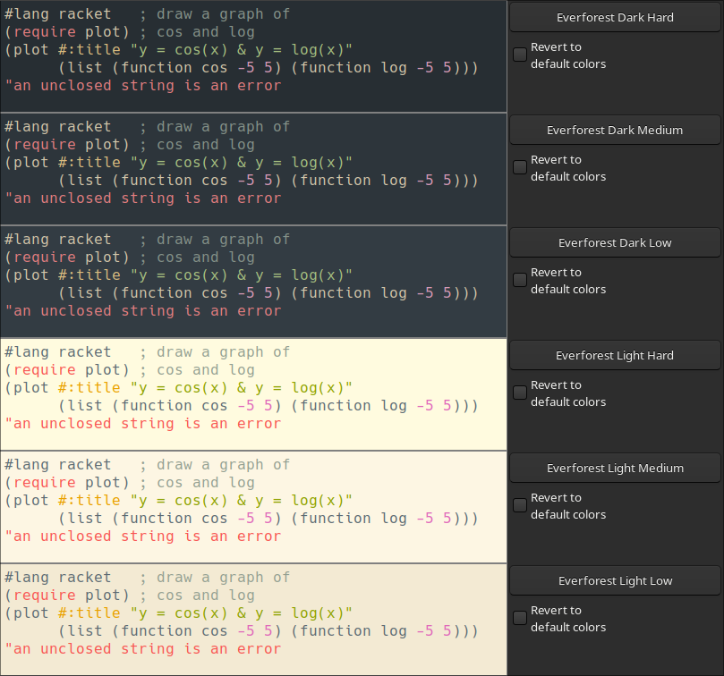

# Everforest Themes for DrRacket

A soothing, nature-inspired color scheme for DrRacket, based on [sainnhe's Everforest palette](https://github.com/sainnhe/everforest/blob/master/palette.md).

## Features

Implements all three contrast styles for both Dark and Light themes from the Everforest palette:
- Dark Hard, Dark Medium, Dark Low
- Light Hard, Light Medium, Light Low



## Installation

There are a lot of ways to install the colorschme. If your new to the world of programming
you may be more comfortable with the [graphical user interface](#the-graphical-way) in DrRacket.  

### The Command Line Way

From the Package Catalog:

```sh
raco pkg install drracket-everforest
```

From Github directly:

```sh
raco pkg install git://github.com/PhictionalOne/drracket-everforest.git
```

From Source:
1. Download this repository
2. Open shell in this folder
3. Install
   ```sh
   raco pkg install ./
   ```

### The Graphical Way

Open DrRacket and then choose one of the following three paths.

From Github directly:
1. Open "Install Package" window: "File" > "Install Package"
2. Paste `https://PhictionalOne/drracket-everforest.git` into text field
3. Click "Install" button

From the Package Catalog:
1. Open the "Package Manager" window: "File" > "Package Manager"
2. Click "Available from Catalog" tab
3. Click "Update Package List"
4. Search for "drracket-everforest"
5. Click on the Result
6. Click "Install" on the bottom of the window

From Source:
1. Download the [Release](https://PhictionalOne/drracket-everforest/releases) as a Zip file
2. Open "Install Package" window: "File" > "Install Package"
3. Click "Browse"
5. Click "File"
6. Select the `drracket-everforest.zip`
7. Click "Install"

## Usage

Once installed, you can select an Everforest theme from DrRacket's color preferences. 

> "Edit" > "Preferences" > "Colors"

Scroll to your desired theme and click on its name to apply it.
The theme will apply to both the definitions and interactions windows.

## License

This project is licensed under the MIT License - see the [LICENSE](LICENSE) file for details.

## Acknowledgments

- [sainnhe](https://github.com/sainnhe) for the original Everforest color palette
